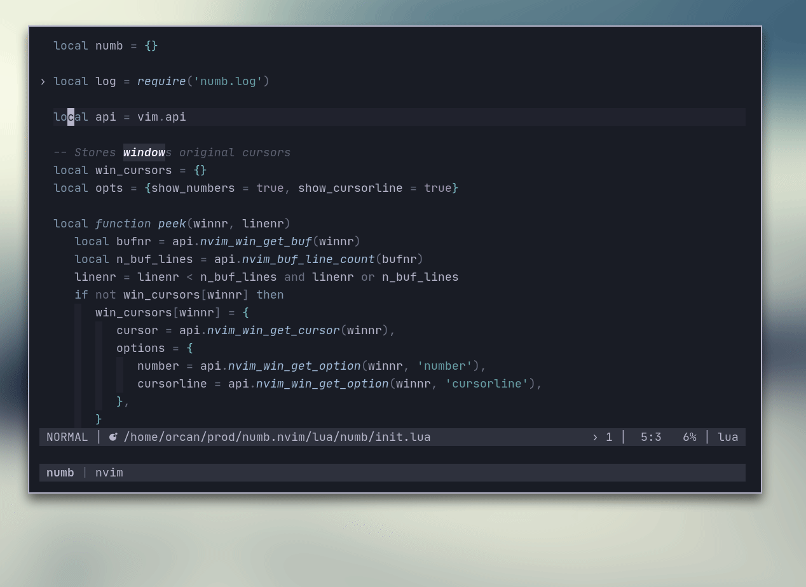

# numb.nvim

Peek a buffer line just when you intend.

## Features

- Peaking buffer while entering command `:{number}`



## Installation

### Packer

```lua
use 'nacro90/numb.nvim'
```

### Paq

```lua
paq 'nacro90/numb.nvim'
```

### Plug

```viml
Plug 'nacro90/numb.nvim'
```

## Usage

Setup with default options:

```lua
require('numb').setup()
```

### Options

You can customize the behaviour with following:

```lua
require('numb').setup{
   show_numbers = true -- Enable 'number' for the window while peaking
   show_cursorline = true -- Enable 'cursorline' for the window while peaking
}
```

After running `setup`, you are good to go. You can try with entering a number to
the vim command line like `:3`.
